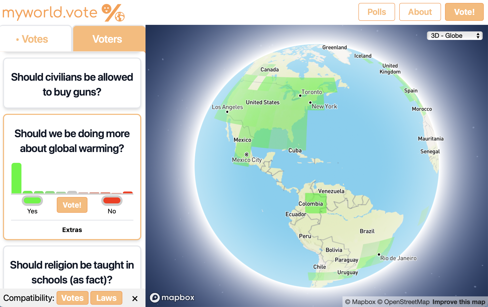

# World Vote
The frontend and backend for a global heatmap-based poll website. Publicly available on at [katzef.com/myworld-vote](https://www.katzef.com/myworld-vote) ...previously [myworld.vote](https://myworld.vote), garnering thousands of responses in the first few weeks, colouring in parts of the world

## Structure
* `web/` laravel web app  
* `src/` bash and python utilities to process data for the web app   

## Web
Early versions had a simple `index.html` that could be loaded in a web browser directly.

We're not in Kansas anymore; navigate to `./web` **IMPORTANT** for both,
1. run `npm run dev` or `prod` to generate the js and css in `/public`  
2. run `php artisan serve` (OR `art serve` if you have the recommended `laravel` shell config)  

The locally-hosted URL will appear in your terminal when running. Navigate to that link in a web browser to see the user interface and explore averaged users' answers.

## Data formats
Several data storage methods and data representations were needed to get everything working. All source code in this repo uses the following language in functions and variables to give type hints.
* `base`: the core data format for all computation. These are numpy arrays (saved as `.npy` on disk) containing vote0_1 (aka vote1, aka [0, 1] float) data sums and counts; one per data channel e.g., `demo0.npy`  
* `db`: database, note that the users table contains responses in vote0_10 (aka vote10, aka [0, 10] int) format
* `zoom array`: numpy array `.npy` of the same name as the data channel, averaged, filtered, and binned for multiple zoom levels, e.g., `z04/demo0.npy`  
* `cells`: `.json` all `zoom array`s at the current zoom aggregated into geojson (one polygon per array cell), e.g., `z04/cells.json`
* `tiles`: `.mbtiles` directly from the `cells` file for that zoom level, e.g., `z04/tiles.mbtiles`  
* `tiles-comb`: `.mbtiles` combining each of the individual `tiles` files (this is the output file ready for mapbox), e.g., `tiles-comb.mbtiles`  

The tasks of reading from database, writing the above formats, and uploading are all described in [src/README.md](src/README.md)

## Useful tools
If you plan to generate map tiles on your own machine, you may find the following tools helpful:
* `tippecanoe`: CLI to convert geojson into mbtiles  
* `mb-util`: CLI to convert mbtiles into vector tile directory structure (optional preprocessing for speed)  
* `mbtiles-serve`: a CLI npm package to serve mbtiles locally (debugging)  
* `mbview`: CLI from mapbox to view locally  

# Authors
Marc Katzef (call me)
